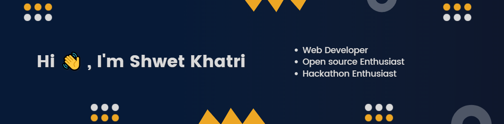

<!-- ----------- HEAD SECTION START ------------ -->

  

 

  

  

<!-- ----------- HEAD SECTION END ------------ -->

<!-- ----------- CONTENT SECTION START ------------ -->
- 🔭 I’m currently working on [Shwetflix](https://shwetflix.netlify.app/)

- 🌱 I’m currently learning [Three.JS](http://threejs.org/)

- 👯 I’m looking to collaborate on **Open Source Projects**

- 👨‍💻 All of my projects are available at [My Portfolio](https://shwetkhatri.netlify.app/)

- 💬 Ask me about **Full Stack Web Development**

- 📄 Know about my experiences from my [Resume](https://drive.google.com/file/d/1qO0gZNqz-dE8LElPdilOH8UG8T0N2Irw/view?usp=sharing)

- 📫 How to reach me <a href="mailto:shwetkhatri2001@gmail.com" style="color: #1f6feb; text-decoration: none;">shwetkhatri2001@gmail.com</a>

<!-- ----------- CONTENT SECTION END ------------ -->

<!-- ----------- STATS SECTION START ------------ -->

  

<!-- ----------- STATS SECTION END ------------ -->

<!-- ----------- TECH STACK SECTION START ------------ -->

<h2 align="center">Tech Stack</h2>

| Domain                             |Technologies                                                                                                                                                                                                                                                                                                                                                                                                                                                                                                                                                                                                                                                                                                                                                                                                                                                                                                                                                                                                                                                                                                                                                                                                                                                                                                                                                                                                                                                                                                                                                                                                                                                                                                                                                                                                                                                                                                                                                                                                                                                                                  |
| ---------------------------------------------- | ------------------------------------------------------------------------------------------------------------------------------------------------------------------------------------------------------------------------------------------------------------------------------------------------------------------------------------------------------------------------------------------------------------------------------------------------------------------------------------------------------------------------------------------------------------------------------------------------------------------------------------------------------------------------------------------------------------------------------------------------------------------------------------------------------------------------------------------------------------------------------------------------------------------------------------------------------------------------------------------------------------------------------------------------------------------------------------------------------------------------------------------------------------------------------------------------------------------------------------------------------------------------------------------------------------------------------------------------------------------------------------------------------------------------------------------------------------------------------------------------------------------------------------------------------------------------------------------------------------------------------------------------------------------------------------------------------------------------------------------------------------------------------------------------------------------------------------------------------------------------------------------------------------------------------------------------------------------------------------------------------------------------------------------------------------------------------------------------ |
| Development |                    |
| Languages   |                                                                                                                                                                                                                                                                                                                                                                                                                                                                                                                                                                                                                                                                                                                                                                                                                                                                                                                                                                                                                                                                                                                                                                                                                                                                                                                                                                                                                                                                                                                                                                                                                                                                                                                                                                                                                 |
| Tools       |                                                                                                                                                                                                                                                                                                                                                                                                                                                                                                                                                                                                                                                                                                                                                                                                                                                                                                                                                                                                                                                                                                                                                                                                                                                                                                       |
| UI/UX       |                                                                                                                                                                                                                                                                                                                                                                                                                                                                                                                                                                                                                                                                                                                                                                                                                                                                                                                                                                                                                                                                                                                                                                                                                                                                                                                                                                                                                                                                                                                                                                                                                                                                                                                                                                                                                                                                        |

  

<!-- ----------- TECH STACK SECTION END------------ -->

<!-- TROPHIES SECTION START -->
 

  

  

 

<!-- TROPHIES SECTION END -->

<!-- ----------- BANNER SECTION START ------------ -->

  

<!-- ----------- BANNER SECTION END ------------ -->

<!-- ----------- SOCIAL SECTION START ------------ -->

<h2 align="center">Connect with me</h2>

 

 
 

                                                                                                                                                           

  

<!-- ----------- SOCIAL SECTION EMD ------------ -->
